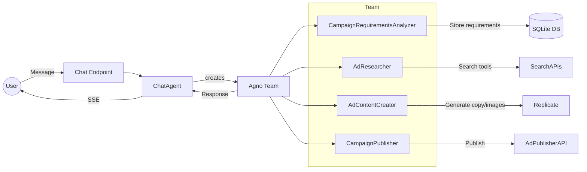
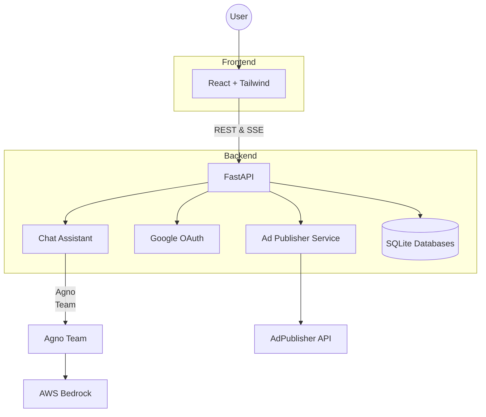

# AdGenius

AdGenius is an AI-powered platform for generating, managing, and optimizing advertising campaigns across different platforms.

**Live Demo**: [https://ad-genius.feedmob.ai/](https://ad-genius.feedmob.ai/)

## Project Overview

AdGenius helps marketers and advertising professionals create effective ad campaigns without the traditional friction and complexity. The platform streamlines the entire process from conceptualization to publication through AI-assisted workflows.

### Target Audience

- Marketing teams at companies of all sizes
- Advertising agencies
- Solo entrepreneurs and small business owners
- Content creators looking to promote their work

### Use Cases

- Creating multi-platform advertising campaigns quickly
- Generating creative ad content based on product/service descriptions
- Analyzing and optimizing existing campaigns
- Publishing finalized ads to AdPublisher platform

## Features

- Google OAuth authentication
- Ad requirement analysis
- AI-powered creative generation
- Campaign management and analytics
- Publishing to AdPublisher platform

## Architecture Diagrams

### Agno Team & Agent Workflow



### Project Architecture



## How It Works

### System Overview

The backend's chat assistant utilizes the Agno framework with AWS Bedrock. The architecture consists of a React UI, FastAPI API, an agent layer for AI processing, and SQLite storage for persistence.

### User Flow

1. Users authenticate via Google OAuth
2. They interact with a chat interface that streams AI responses in real time via Server-Sent Events
3. The agent team analyzes ad requirements, generates ad copy and images, and can publish campaigns if requested

### Multimodal Elements

While text-based chat is primary, the ad content creator can generate or describe images with the Replicate API and a Bedrock model, providing image URLs and descriptions.

## Technology Stack

- **Frontend**: React with TypeScript and Tailwind CSS
- **Backend**: Python with FastAPI
- **AI**: Agno agent framework and AWS Bedrock models
- **Database**: SQLite via SQLAlchemy
- **Authentication**: Google OAuth
- **Additional Tools**:
  - SSE-Starlette for streaming responses
  - DuckDuckGo & Tavily tools for research
  - Replicate for image generation
  - Custom AdPublisher API integration

## User Interface

The UI is a single-page React app with a dashboard displaying a sidebar and chat panel. The ChatPanel component maintains conversation state, handles SSE streaming, and provides an input area and detail side panel.

## Project Structure

- `frontend`: React TypeScript application with Tailwind CSS
- `backend`: FastAPI Python application

## Prerequisites

- Node.js (v23.11.0+)
- Python (v3.12+)
- Google Developer Account for OAuth credentials
- Just (command runner)
- Bun (JavaScript runtime)
- uv (Python package installer)

## Setup and Installation

### Installing Just (Command Runner)

Just is the command runner used to simplify running tasks in this project.

```bash
# Using curl (recommended for most systems)
curl --proto '=https' --tlsv1.2 -sSf https://just.systems/install.sh | bash -s -- --to ~/.local/bin
# Add to PATH if needed
export PATH="$HOME/.local/bin:$PATH"
```

For more installation options, see [Just Installation Documentation](https://github.com/casey/just?tab=readme-ov-file#pre-built-binaries).

### Installing Bun (JavaScript Runtime)

Bun is used for the frontend JavaScript package management.

```bash
# Using curl as mentioned in step 2 of Frontend Setup
curl -fsSL https://bun.sh/install | bash
```

After installation, you may need to restart your terminal or run:

```bash
source ~/.bashrc  # If using bash
source ~/.zshrc   # If using zsh
source ~/.config/fish/config.fish  # If using fish
```

For more installation options, see [Bun Installation Documentation](https://bun.sh/docs/installation).

### Backend Setup

1. Install **uv** (a drop-in replacement for pip/venv):

```bash
curl -LsSf https://astral.sh/uv/install.sh | sh
```

2. Navigate to the backend directory:

```bash
cd ad-genius/backend
```

3. Create a virtual environment and install dependencies:

```bash
uv venv .venv
source .venv/bin/activate  # On Windows: .venv\Scripts\activate
uv sync
```

4. Create a `.env` file based on the `.env.example`:

```bash
cp .env.example .env
```

5. Configure your `.env` file with the following environment variables:

   - `SECRET_KEY`: JWT secret key
   - `GOOGLE_CLIENT_ID`: Google OAuth client ID
   - `GOOGLE_CLIENT_SECRET`: Google OAuth client secret
   - `GOOGLE_REDIRECT_URI`: OAuth callback URL
   - `FRONTEND_URL`: Frontend URL for CORS
   - `DATABASE_URL`: SQLite database URL (default: sqlite+aiosqlite:///./adgenius.db)
   - `AWS_ACCESS_KEY_ID`: AWS key for Bedrock
   - `AWS_SECRET_ACCESS_KEY`: AWS secret key
   - `AWS_REGION`: AWS region (default `us-east-1`)
   - `AGNO_API_KEY`: API key for Agno
   - `TAVILY_API_KEY`: Tavily search key
   - `REPLICATE_API_TOKEN`: Replicate key for media generation (get one at [replicate.com](https://replicate.com/))
   - `AD_PUBLISHER_API_KEY`: API key for the Ad Publisher service (available at [ads-publisher.feedmob.ai](https://ads-publisher.feedmob.ai))

6. Set up Google OAuth credentials:
   - Go to [Google Cloud Console](https://console.cloud.google.com/)
   - Create a new project
   - Navigate to APIs & Services > Credentials
   - Create OAuth client ID (Web application type)
   - Add authorized redirect URIs: `http://localhost:8000/api/v1/auth/callback`
   - Copy Client ID and Client Secret to your `.env` file

### Frontend Setup

1. Navigate to the frontend directory:

```bash
cd ad-genius/frontend
```

2. Install [Bun](https://bun.sh) if you don't have it:

```bash
curl -fsSL https://bun.sh/install | bash
```

3. Install dependencies with Bun:

```bash
bun install
```

4. Create a `.env` file in the `frontend` folder and specify the API URL:

```bash
echo "VITE_API_URL=http://localhost:8000" > .env
```

This environment variable is required:

- `VITE_API_URL`: Backend API URL

## Running the Application

### Start the backend server:

```bash
just backend
```

### Start the frontend development server:

```bash
just frontend
```

The application will be available at:

- Frontend: http://localhost:5173
- Backend API: http://localhost:8000
- API Documentation: http://localhost:8000/docs

## Deployment

The application is deployed and available at:

- [https://ad-genius.feedmob.ai/](https://ad-genius.feedmob.ai/)

Once your ad campaign is published, you can visit [https://ads-publisher.feedmob.ai](https://ads-publisher.feedmob.ai) to view your ad performance.
For demo purposes, you may use the following account credentials:

- **Email:** `richard@feedmob.com`
- **Password:** `devtesting`

## Development

## Troubleshooting

If you encounter any issues during setup:

1. Make sure all prerequisites are correctly installed
2. Check that your environment variables are properly set
3. Verify that your Google OAuth credentials have the correct redirect URI
4. Look at the server logs for more detailed error messages

## Next Steps / Learning Pointers

Once you have the application running locally, explore the repository further to
understand how each component works:

1. **Run the project locally** – After installing dependencies, use the `just`
   tasks to start each service: `just backend` and `just frontend`.
2. **Explore the Chat Assistant** – `backend/chat_assistant/README.md` explains
   how the agent, storage layer and SSE streaming fit together.
3. **Study available API endpoints** – `backend/README.md` lists ad campaign and
   chat routes in detail.
4. **Review configuration & logging** – `backend/utils/README.md` documents the
   logging system and environment-based configuration helpers.
5. **Learn the testing workflow** – `backend/TESTING.md` describes how to run
   the pytest suite with options for coverage and parallel mode.

These documents are great starting points if you're looking to extend or
customize the platform.
