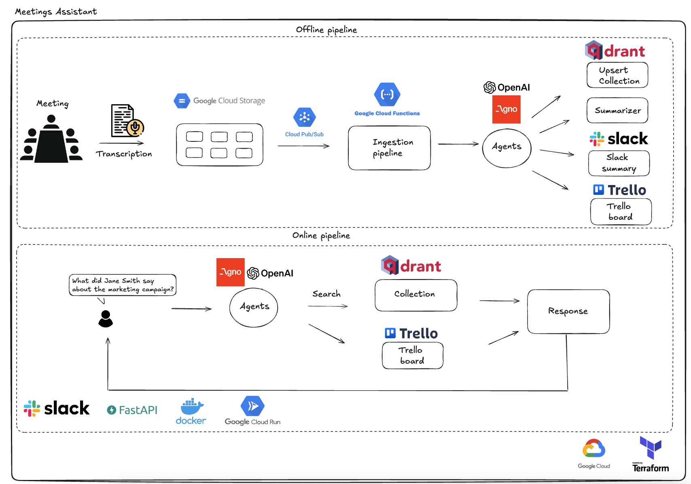

# Meeting Automation Pipeline with LLM Agents, Slack, and Trello

This project automates meeting processing using LLM agents using Agno integrated with Slack, Trello, and Qdrant. It includes both **offline** and **online** pipelines, leveraging Google Cloud Platform (GCP) services, Terraform for infrastructure, and Docker for deployment.

## Architecture Diagram


## 🚀 Overview

- Automatically processes meeting transcripts uploaded to a GCP bucket.
- Uses agents (via [Agno](https://github.com/agno-agi/agno)) to:
  - Summarize meetings.
  - Send summaries to a Slack channel.
  - Detect and create Trello tasks.
- Enables Slack users to query past meetings based on semantic search from vector embeddings.
- Uses Qdrant as a vector store to store and retrieve meeting data.

## 🧠 Workflow

### Offline Pipeline:
1. A meeting transcript is uploaded to a GCP bucket.
2. A **Pub/Sub** topic is configured to listen to new file uploads. When a file is uploaded, an event is published. The Pub/Sub topic triggers a Cloud Function.
3. The Cloud Function:
   - Converts the transcript into embeddings.
   - Stores embeddings and metadata into **Qdrant**.
   - Triggers a team of agents:
     - A **lead agent** routes the request to the appropriate LLM.
     - A **summary agent** writes the meeting **summary**.
     - A **Slack agent** shares the summary in **Slack**.
     - A **Trello agent** identifies action items and creates **Trello** cards.

### Online Pipeline:
- A **Slack user** can tag the **agent** in a channel and **ask questions** about previous meetings.
- A cloud-hosted endpoint (**Cloud Run**) receives **Slack** messages and queries **Qdrant** for relevant information.
- Updates **Trello** board.

## 🛠 Tech Stack

- **Language:** Python
- **Backend:** FastAPI
- **Infrastructure:** Terraform, GCP (Cloud Functions, Pub/Sub, Cloud Run, Secret Manager)
- **Vector Database:** Qdrant
- **LLMs:** OpenAI (GPT-4.0, GPT-4.1)
- **Embeddings:** OpenAI
- **Agents:** Agno
- **Containerization:** Docker
- **Other tools:** Slack API, Trello API

## 🔐 Environment Variables & Secret Configuration

To run this project securely, you’ll need to set up the following secrets in **Google Secret Manager**. These are used for authenticating with external APIs and managing integrations:

### Required Secrets

| Secret Name            | Purpose                                     |
|------------------------|---------------------------------------------|
| `OPENAI_API_KEY`       | For calling OpenAI's LLM and embeddings API |
| `QDRANT_API_KEY`       | API key to access your Qdrant instance      |
| `QDRANT_URL`           | Endpoint URL of your Qdrant instance        |
| `SLACK_TOKEN`          | Slack Bot OAuth token                       |
| `SLACK_BOT_USER_ID`    | Slack bot’s user ID                         |
| `SLACK_SIGNING_SECRET` | Slack app signing secret                    |
| `TRELLO_API_KEY`       | Trello API key                              |
| `TRELLO_API_SECRET`    | Trello API secret                           |
| `TRELLO_TOKEN`         | Trello user token                           |


These secrets are defined in the `Terraform` configuration using `google_secret_manager_secret` resources. You must update the values of these secrets in the GCP Secret Manager during your infrastructure setup.


## Setup & Usage
1. Clone the repository:
```bash
git clone <url>
cd churn-prediction
```

2. Set up virtual environment and dependencies:
```bash
uv venv --python 3.12
source .venv/bin/activate
uv sync
```

3. Set Up Environment Variables. Copy secrets_version.tf.example to secrets_version.tf and update the necessary values:
```bash
cp secrets_version.tf.example secrets_version.tf
```

4. GCP Setup
- Create a GCP project and authenticate
```bash
gcloud config set project <project-id>
gcloud auth application-default set-quota-project <project-id>
```

5. Terraform Bootstrap
- Edit terraform.tfvars with your values
```bash
cd infra/terraform-bootstrap
terraform init
terraform plan
terraform apply
```

6. Find the bucket name:
```bash
terraform output
```

7. Terraform Backend Setup:
- Create backend.conf and fill in bucket and prefix
- Edit terraform.tfvars with your values
```bash
cd ../terraform
echo 'bucket = "<bucket-name>"\nprefix = "terraform/state"' > backend.conf
terraform init -backend-config=backend.conf
terraform plan
terraform apply
```

8. Running the Pipelines
- Offline Pipeline
```bash
./offline_pipeline.sh
```

- Online Pipeline
```bash
./build_image.sh
./cloud_run.sh
```

## Support & Contributions

If you found this project useful or interesting, consider giving it a ⭐ on GitHub! It helps others discover it and keeps me motivated to improve and add new features.

Feel free to open issues, suggest improvements, or contribute to the project. Any feedback is appreciated!
